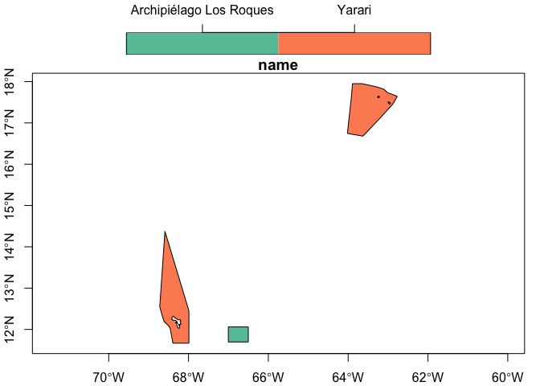

ppapi
================

[Protected Planet](https://www.protectedplanet.net/en) provides a
limited access [API](https://api.protectedplanet.net/) for
programmatically downloading metadata about World Database on Protected
Areas (WDPA) entries. Users of this package can request metadata by
unique WDPA IDs rather than by country.

## Requirements

-   [R v4.1+](https://www.r-project.org/)
-   [dplyr](https://CRAN.R-project.org/package=dplyr)
-   [rappdirs](https://CRAN.R-project.org/package=rappsdir)
-   [httr](https://CRAN.R-project.org/package=httr)
-   [sf](https://CRAN.R-project.org/package=sf)

## Installation

    remotes::install_github("BigelowLab/ppapi")

## Setup credentials

Request access by following the instructions on this
[page](https://api.protectedplanet.net/request). Once registered for an
API key (aka token), store the token securely using…

``` r
suppressPackageStartupMessages({
  library(dplyr)
  library(sf)
  library(ppapi)
})

# only run the next line once - commented out so it won't balk with a warning
# but if this is your first time, then please do run the next line.
# ppapi::write_pp_token("this_is_where_you_put_your_key")
```

The token will be stored in a hidden subdirectory in you home directory.
Once placed there you can forget it as the package will load it as
needed.

## Usage

Provide the WDPAID(s) to retrieve - results can be a list, tibble
(data.frame) or sf data frame (default).

``` r
# Yarari, Archipiélago Los Roques
id <- c(555703527, 2245)
x <- pp_get_wdpa(id)

plot(x['name'], key.pos = 3, axes = TRUE)
```

<!-- -->

And alternative view (that doesn’t play welll with HTML markdown output)
is to use the [leaflet](https://CRAN.R-project.org/package=sf) package.

    library(leaflet)
    leaflet(data = x) |>
        addTiles() |>
        addPolygons(color = ~colorFactor("Dark2", name)(name),
                    opacity = 1, 
                    fillColor = ~colorFactor("Dark2", name)(name),
                    fillOpacity = 0.5)


You can also look at what Protected Planet shows for each WDPA.

    pp_browse(id[1])
    pp_browse(id[2])

These don’t render for HTML markdown but they do at the R console. In
the meantime you can point your browser to
[pp_browse(id\[1\])](https://www.protectedplanet.net/555703527) and
[pp_browse(id\[2\])](https://www.protectedplanet.net/2245).

## References

Inspired by [wdpar](https://CRAN.R-project.org/package=wdpar), but we
needed finer granularity than country-level fetching.

[Protected Planet](https://api.protectedplanet.net/)

Modify the following for
[attribution](https://www.protectedplanet.net/en/legal) as needed.

> UNEP-WCMC and IUCN (2022), Protected Planet: \[insert name of
> component database; The World Database on Protected Areas (WDPA)/The
> World Database on Other Effective Area-based Conservation Measures
> (WD-OECM)/The Global Database on Protected Areas Management
> Effectiveness (GD-PAME)\] \[On-line\], \[insert month/year of the
> version downloaded\], Cambridge, UK: UNEP-WCMC and IUCN. Available at:
> www.protectedplanet.net.

[rnaturalearthhires](https://docs.ropensci.org/rnaturalearthhires/) \>
South A (2022). rnaturalearthhires: High Resolution World Vector Map
Data from Natural Earth used in rnaturalearth.
<https://docs.ropensci.org/rnaturalearthhires>,
<https://github.com/ropensci/rnaturalearthhires>.
